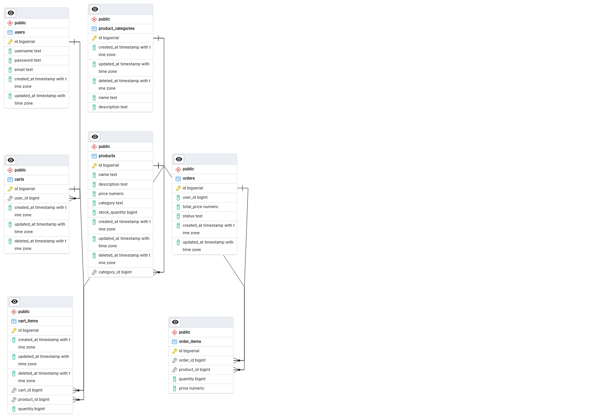

# E-commerce API

This is an e-commerce API built with Go, GORM, Redis and PostgreSQL. The API supports user registration, authentication with JWT, product management, shopping cart management, and order processing.

## Features

- User Registration and Login
- JWT Authentication
- Product Management
- Shopping Cart Management
- Order Processing

## Technologies Used

- Go
- GORM
- PostgreSQL
- Gin
- JWT
- Redis

## Getting Started

### Prerequisites

- Go 1.22+
- PostgreSQL
- Docker (optional, for containerization)

### Installation

1. Clone the repository:

   ```sh
   git clone https://github.com/IkhsanHamid/golang-api
   cd golang-api
   ```

2. Install dependencies:

   ```sh
   go mod tidy
   ```

3. Configure the database:

   Update the `config/config.go` file with your PostgreSQL credentials.

4. Run the application:

   ```sh
   go run main.go
   ```

### Running with Docker

1. Build the Docker image:

   ```sh
   docker build -t golang-api .
   ```

2. Run the Docker container:

   ```sh
   docker run -p 8080:8080 golang-api
   ```

### API Endpoints

#### User Endpoints

- `POST /register`: Register a new user
- `POST /login`: Login a user and receive a JWT token

#### Product Endpoints

- `GET /products`: Fetch all products
- `POST /products`: Create a new product (requires authentication)
- `PUT /products/:id`: Update an existing product (requires authentication)
- `DELETE /products/:id`: Delete a product (requires authentication)

#### Cart Endpoints

- `POST /cart`: Add a product to the cart (requires authentication)
- `GET /cart`: Fetch the user's cart (requires authentication)
- `DELETE /cart/:product_id`: Remove a product from the cart (requires authentication)

#### Order Endpoints

- `POST /orders`: Create a new order (requires authentication)
- `GET /orders`: Fetch the user's orders (requires authentication)

### Configuration

The database connection is configured in the `config/config.go` file:

```go
package config

import (
    "golang-api/models"
    "gorm.io/driver/postgres"
    "gorm.io/gorm"
)

var DB *gorm.DB

func ConnectDatabase() {
    dsn := "host=localhost user=postgres password=yourpassword dbname=ecommerce port=5432 sslmode=disable"
    database, err := gorm.Open(postgres.Open(dsn), &gorm.Config{})
    if err != nil {
        panic("Failed to connect to database!")
    }

    database.AutoMigrate(&models.User{}, &models.Product{}, &models.Cart{}, &models.Order{}, &models.OrderItem{})

    DB = database
}
```

### Project structure

```
├── controllers
│ ├── productController.go
│ ├── cartController.go
│ ├── userController.go
│ ├── orderController.go
├── middleware
│ └── authMiddleware.go
├── models
│ ├── product.go
│ ├── cart.go
│ ├── user.go
│ ├── order.go
│ ├── orderItem.go
├── utils
│ ├── hash.go
│ ├── jwt.go
├── config
│ └── config.go
├── routes
│ └── routes.go
├── main.go
├── Dockerfile
├── docker-compose.yml
└── README.md
```


